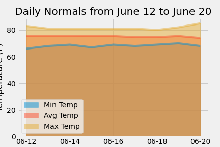

# sqlalchemy-challenge

## Background

You've decided to treat yourself to a long holiday vacation in Honolulu, Hawaii! To help with your trip planning, you need to do some climate analysis on the area. 

## Step 1 - Climate Analysis and Exploration

Using Python and SQLAlchemy, we execute a basic climate analysis and data exploration of a climate database. All of the following analysis were completed using SQLAlchemy ORM queries, Pandas, and Matplotlib.

### Setup Dependencies, Create Engine, Create Session Link to Database

	  # Python SQL toolkit and Object Relational Mapper
	  import sqlalchemy
	  from sqlalchemy.ext.automap import automap_base
	  from sqlalchemy.orm import Session
	  from sqlalchemy import create_engine, func
	  # Create Engine
	  engine = create_engine("sqlite:///Resources/hawaii.sqlite")
	  # reflect an existing database into a new model
	  Base = automap_base()
	  # We can view all of the classes that automap found
	  Base.classes.keys()
	  # reflect the tables
	  Base.prepare(engine, reflect=True)

### Precipitation Analysis

#### Design a query to retrieve the last 12 months of precipitation data.

	# Calculate the date 1 year ago from the last data point in the database
	recent_date = session.query(Measurements.date).order_by(Measurements.date.desc()).first()
	(last_point,) = recent_date
	last_point = dt.datetime.strptime(last_point, '%Y-%m-%d')
	last_point = last_point.date()
	one_year = last_point-dt.timedelta(days=365)

#### Select only the `date` and `prcp` values and save into pandas data frame.

	# Perform a query to retrieve the data and precipitation scores
	Data = session.query(Measurements.date,Measurements.prcp).\
	    filter(Measurements.date>=one_year).all()
	# Save the query results as a Pandas DataFrame and set the index to the date column
	Data_df = pd.DataFrame(Data, columns = ['Date', 'Precipitation']).set_index('Date')
	# Drop null values (if any).
	Data_df = Data_df.dropna(how="any")

#### Plot the results using the DataFrame `plot` method.

#### Use Pandas to print the summary statistics for the precipitation data.

### Station Analysis

#### Design a query to calculate the total number of stations.

	# Design a query to show how many stations are available in this dataset?
	num_stations = session.query(Stations.station).count()

#### Design a query to find the most active stations.

	counts = session.query(Measurements.station, func.count()).\
    		group_by(Measurements.station).\
    		order_by(func.count().desc()).all()
	for station, count in counts:
	    print(station, count)

#### Determine which station has the highest number of observations.

	Active_station = session.query(Measurements.station).\
	    group_by(Measurements.station).\
	    order_by(func.count().desc()).first()
	(station_ID,)=Active_station
	print(f"The most active station is {station_ID}.")
	temps = session.query(func.min(Measurements.tobs), func.max(Measurements.tobs), func.avg(Measurements.tobs)).\
	filter(Measurements.station == station_ID).all()

#### Design a query to retrieve the last 12 months of temperature observation data (TOBS).

	#Calculate 12 months before recent point 
	Active_Station_Date = session.query(Measurements.date).\
	    order_by(Measurements.date.desc()).\
	    filter(Measurements.station == station_ID).\
	    first()

	(last_point,) = Active_Station_Date
	last_point = dt.datetime.strptime(last_point, '%Y-%m-%d')
	last_point = last_point.date()
	one_year = last_point-dt.timedelta(days=365)

	#Filter to grab a years worth of data
	Year_Station_Data = session.query(Measurements.date,Measurements.tobs).\
	    filter(Measurements.date>=one_year).\
	    filter(Measurements.station == station_ID).all()

#### Plot the results as a histogram with `bins=12` filtering by the station with the highest number of observations.

#### Plot the average temperature for a week of choice.

#### Plot the daily normal temperatures for a week of choice.

## Step 2 - Climate App

After completing your initial analysis, a Flask API was designed based on the queries that were developed in Step 1.

* Use Flask to create your routes.

### Routes

* `/`

  * Home page.

  * List all routes that are available.

* `/api/v1.0/precipitation`

  * Convert the query results to a dictionary using `date` as the key and `prcp` as the value.

  * Return the JSON representation of your dictionary.

* `/api/v1.0/stations`

  * Return a JSON list of stations from the dataset.

* `/api/v1.0/tobs`
  
  * Query the dates and temperature observations of the most active station for the last year of data.
  
  * Return a JSON list of temperature observations (TOBS) for the previous year.

* `/api/v1.0/<start>` and `/api/v1.0/<start>/<end>`

  * Return a JSON list of the minimum temperature, the average temperature, and the max temperature for a given start or start-end range.

  * When given the start only, calculate `TMIN`, `TAVG`, and `TMAX` for all dates greater than and equal to the start date.

  * When given the start and the end date, calculate the `TMIN`, `TAVG`, and `TMAX` for dates between the start and end date inclusive.

